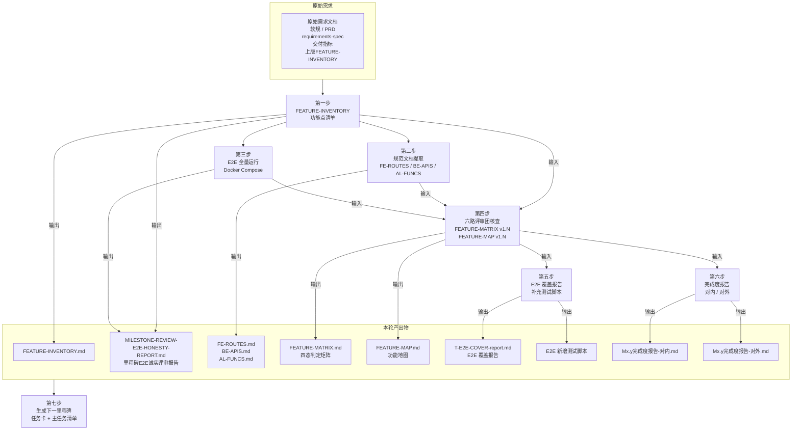

# Milestone Spec Workflow

{project_name} 的里程碑规范整理与核查对齐流程。确保每个 Milestone 结束时，需求文档、规范基准、实现、E2E 测试四者 100% 对齐，并生成下一里程碑的启动任务。

**重要说明: 每次调用这个技能如无特别说明都是指重新分析需求文档、源码、重新跑全量E2E，走完整的闭环分析流程。因为: 源码、文档时刻在变化，这个技能的目的就是全面复核文档和技术实现的差异。**

---

## 核心概念

### 规范对齐流程图



### 四态定义

| 状态 | 含义 |
|------|------|
| ✅ 存在 | 功能完整实现，可正常使用 |
| ⬆️ 增强 | 在基本要求上有额外增强 |
| ⬇️ 弱化 | 部分实现，有已知限制 |
| ❌ 不存在 | 完全未实现或代码不存在 |
| 🟡 骨架 | 有文件框架但逻辑未完成 |

---

## Kimi Agent 调度协议

本工作流大量依赖并行 Subagent 执行。主 Agent 通过以下方式调度：

1. **并行提取**（第二步）：3 个 Agent 分别提取 FE/BE/AL 规范，互不依赖
2. **并行评审**（第四步 4.1）：6 个 Reviewer Agent 同时独立评审，主 Agent 汇总
3. **角色 Agent**（第五~七步）：tester / architect 等角色由独立 Agent 执行，主 Agent 验收
4. **状态传递**：通过文件系统读写（`specs/*.md`、`tasks/*/reviews/*.md`）
5. **阻塞等待**：每步 foreground Agent 完成后，主 Agent 读取产出、检查门禁，再进入下一步

> 所有 Agent 的 prompt 中必须注入 `{WORKSPACE_ROOT}`（项目绝对路径），禁止 hardcoded 路径。

---

## 核心流程

### 第一步：提取功能点清单（FEATURE-INVENTORY）

**目标**：从原始需求文档提取完整功能点列表，作为所有后续工作的基准线。

**输入**：
- 原始需求文档
- 软规
- PRD
- requirements-spec
- 交付指标
- 上版 FEATURE-INVENTORY.md（如有）

**输出**：
- `specs/FEATURE-INVENTORY.md`

**格式**：四层 ID 体系 `{模块}.{子模块}.{功能}.{子功能}`，参考 `references/feature-inventory-template.md`

**执行者**：主 Agent 或 developer Agent（产品视角）

---

### 第二步：规范文档提取

**目标**：从源码中提取前端路由、后端 API、算法接口，形成规范基准。

**输入**：
- 源码（前端 Vue 路由 / 后端 Controller / Python 算法服务）

**输出**：
- `specs/FE-ROUTES.md`
- `specs/BE-APIS.md`
- `specs/AL-FUNCS.md`

**执行方式**：主 Agent **并行**调度 3 个 Agent：

```
Agent(description="FE routes extraction")
  prompt: 读取 frontend/src/router/ 和 frontend/src/views/，提取所有路由和页面，写入 specs/FE-ROUTES.md

Agent(description="BE APIs extraction")
  prompt: 读取 backend/*/internal/controller/，提取所有 Controller 和 API 端点，写入 specs/BE-APIS.md

Agent(description="AL funcs extraction")
  prompt: 读取 algo/api/ 和 algo/src/，提取所有算法接口和端点，写入 specs/AL-FUNCS.md
```

三份文档**同时**并行提取，相互不依赖。

---

### 第三步：E2E 全量运行

**目标**：启动 Docker Compose 环境，执行全量 E2E 测试，收集第一手真实数据。

**输入**：
- `tests/e2e/*.spec.ts`
- Docker Compose 环境

**执行**：
```bash
cd deployment
# COMPOSE_FILE环境变量已配，不需要加 -f 参数
docker compose up -d
docker compose run --rm test-e2e
```

**执行者**：tester Agent（或主 Agent 直接执行 Shell）

---

### 第四步：六路评审团核查 + 里程碑 E2E 诚实评审

**目标**：六路独立评审识别矩阵偏差；汇总 E2E 数据生成里程碑诚实评审报告。

#### 4.1 六路评审团核查

**输入**：
- `specs/FEATURE-INVENTORY.md`
- `specs/FEATURE-MATRIX.md`（当前版本）
- `specs/FEATURE-MAP.md`（当前版本）
- `specs/FE-ROUTES.md`
- `specs/BE-APIS.md`
- `specs/AL-FUNCS.md`

**输出**：
- `tasks/{date}-M{x}.{y}/reviews/architect-review.md`
- `tasks/{date}-M{x}.{y}/reviews/developer-be-review.md`
- `tasks/{date}-M{x}.{y}/reviews/developer-fe-review.md`
- `tasks/{date}-M{x}.{y}/reviews/developer-al-review.md`
- `tasks/{date}-M{x}.{y}/reviews/developer-test-review.md`
- `tasks/{date}-M{x}.{y}/reviews/developer-pm-review.md`
- `tasks/{date}-M{x}.{y}/reviews/consolidated-review.md`
- `specs/FEATURE-MATRIX.md`（升至 v1.N）
- `specs/FEATURE-MAP.md`（升至 v1.N）

**执行方式**：主 Agent **并行**调度 6 个 Reviewer Agent：

| Agent | description | 评审视角 | 产出文件 |
|-------|-------------|---------|---------|
| architect-reviewer | 架构一致性评审 | 全局一致性、架构决策追溯、跨模块对齐 | architect-review.md |
| be-reviewer | 后端实现完整性评审 | API 契约、代码落脚点 | developer-be-review.md |
| fe-reviewer | 前端实现完整性评审 | 路由菜单、UI 交互 | developer-fe-review.md |
| al-reviewer | 算法实现完整性评审 | Registry 接入、协议支持 | developer-al-review.md |
| test-reviewer | 测试覆盖与风险评审 | E2E 链路、缺口风险 | developer-test-review.md |
| pm-reviewer | 需求覆盖与 Phase 边界评审 | PRD 对齐、用户体验 | developer-pm-review.md |

每个 Agent 的 prompt 包含：
- `{WORKSPACE_ROOT}` 绝对路径
- 评审对象文件路径（上述 6 份 specs）
- 角色定义和评审要点（参考 `references/REVIEW-TEAM-template.md`，将其中的 `{项目知识库路径}` 替换为实际 `{WORKSPACE_ROOT}`）
- 产出路径：`tasks/{date}-M{x}.{y}/reviews/{role}-review.md`

**主 Agent 汇总**：读取 6 份 review，合并输出 `consolidated-review.md`，并更新 `FEATURE-MATRIX.md` / `FEATURE-MAP.md`。

#### 4.2 E2E 诚实报告

**输入**：
- `tests/e2e/*.spec.ts`
- `specs/BE-APIS.md`

**输出**：
- `tasks/{date}-M{x}.{y}/reviews/T-E2E-RERUN-report.md`（passed/skipped/failed 精确数字）
- `reviews/M{x}-MILESTONE-REVIEW-E2E-HONESTY-REPORT.md`（里程碑 E2E 诚实评审报告）

**内容要求**：参考 `references/e2e-milestone-review-report.md`

**执行者**：tester Agent

---

### 第五步：E2E 覆盖报告

**目标**：识别 E2E 测试对功能清单的覆盖缺口，补充必要测试脚本。

**输入**：
- `specs/FEATURE-INVENTORY.md`
- `specs/FEATURE-MATRIX.md`（v1.N）
- `specs/user-stories.md`
- `tests/e2e/*.spec.ts`
- `reviews/M{x}-MILESTONE-REVIEW-E2E-HONESTY-REPORT.md`
- `tasks/{date}-M{x}.{y}/reviews/T-E2E-RERUN-report.md`
- `tasks/{date}-M{x}.{y}/reviews/consolidated-review.md`

**输出**：
- `tests/e2e/test-m{module}-{name}.spec.ts`
- `tasks/{date}-M{x}.{y}/reviews/T-E2E-COVER-report.md`

**执行者**：tester Agent

---

### 第六步：完成度报告

**目标**：输出双视角完成度报告。

**输入**：
- `reviews/M{x}-MILESTONE-REVIEW-E2E-HONESTY-REPORT.md`
- `specs/FEATURE-MATRIX.md`（v1.N）
- `tasks/{date}-M{x}.{y}/reviews/T-E2E-COVER-report.md`
- `tasks/{date}-M{x}.{y}/reviews/consolidated-review.md`

**输出**：
- `docs/Phase{x}-{y}-完成度报告-对内.md`
- `docs/Phase{x}-{y}-完成度报告-对外.md`

**执行者**：architect Agent（或主 Agent）

---

### 第七步：生成下一里程碑任务卡 + 主任务清单

**目标**：基于本轮所有产出物，为下一里程碑生成启动任务卡和主任务清单。

**输入**：
- `specs/FEATURE-MATRIX.md`（v1.N，含 P0/P1/P2 遗留问题清单）
- `tasks/{date}-M{x}.{y}/reviews/consolidated-review.md`（遗留问题优先级）
- `reviews/M{x}-MILESTONE-REVIEW-E2E-HONESTY-REPORT.md`（E2E 关键发现）
- `tasks/{date}-M{x}.{y}/reviews/T-E2E-COVER-report.md`（覆盖缺口）
- `docs/Phase{x}-{y}-完成度报告-对内.md`（对内报告中的下一步行动）

**输出**：
- `tasks/{date}-M{x}.{y+1}/index.md`
- `tasks/{date}-M{x}.{y+1}/master-track.md`
- `tasks/{date}-M{x}.{y+1}/cards/T-E2E-*.md`
- `tasks/{date}-M{x}.{y+1}/cards/T-FE-*.md`
- `tasks/{date}-M{x}.{y+1}/cards/T-BE-*.md`
- `tasks/{date}-M{x}.{y+1}/cards/T-AL-*.md`
- `tasks/{date}-M{x}.{y+1}/cards/T-TEST-*.md`

**格式要求**：
- `index.md` 参考 `document/team/specs/master-task-list-format-spec.md`
- 任务卡参考 `document/team/specs/task-card-format-spec.md`
- 任务卡中引用本轮产出物时使用绝对路径

**执行者**：architect Agent（或主 Agent）

---

## 门禁检查清单

每步完成后必须通过 Checkpoint 才允许进入下一步：

| Checkpoint | 要求 | 对应步骤 |
|------------|------|---------|
| #1 需求基准 | FEATURE-INVENTORY.md 提取自原始需求文档，四层 ID 体系完整 | 第一步 |
| #2 E2E运行 | Docker Compose 全量 E2E 已执行，输出原始测试日志 | 第三步 |
| #3 规范基准 | FE-ROUTES / BE-APIS / AL-FUNCS 覆盖全部端点/路由/接口 | 第三步 |
| #4 矩阵封版 | 六路评审通过，综合报告含全部偏差+源码证据，矩阵升至 v1.N；E2E 诚实报告含关键发现 | 第四步 |
| #5 E2E覆盖封版 | 覆盖报告含场景×测试映射 + 功能点×E2E映射，新增测试符合规范 | 第五步 |
| #6 报告封版 | 对内含 P0/P1 清单，对外含 8 模块 + 11 成果，数字与 E2E 诚实报告一致 | 第六步 |
| #7 任务卡生成 | 下一里程碑任务卡 + index.md + master-track.md 已生成 | 第七步 |

---

## 文件输出路径规范

```
tasks/{date}-M{x}.{y}-spec-consolidation/
├── index.md                  # 主任务清单（含任务总览、依赖图、门禁）
├── master-track.md           # 任务总表（含调度状态、产出物清单）
├── cards/                   # 任务卡片
│   ├── T-E2E-RERUN.md
│   ├── T-FE-ROUTES.md
│   ├── T-BE-APIS.md
│   ├── T-AL-FUNCS.md
│   ├── T-FEATURE-REV.md
│   ├── T-E2E-COVER.md
│   └── T-REPORT-INTERNAL/EXTERNAL.md
└── reviews/
    ├── T-E2E-RERUN-report.md
    ├── M{x}-MILESTONE-REVIEW-E2E-HONESTY-REPORT.md
    ├── T-E2E-COVER-report.md
    ├── architect-review.md
    ├── developer-be-review.md
    ├── developer-fe-review.md
    ├── developer-al-review.md
    ├── developer-test-review.md
    ├── developer-pm-review.md
    └── consolidated-review.md

specs/
├── FEATURE-INVENTORY.md
├── FEATURE-MATRIX.md
├── FEATURE-MAP.md
├── FE-ROUTES.md
├── BE-APIS.md
└── AL-FUNCS.md

docs/
├── Phase{x}-{y}-完成度报告-对内.md
└── Phase{x}-{y}-完成度报告-对外.md
```

---

## 参考文档

### 本 skill references（执行时按需读取）

| 参考文档 | 内容 | 何时读取 |
|---------|------|---------|
| `references/feature-inventory-template.md` | FEATURE-INVENTORY.md 格式模板 | 第一步 |
| `references/feature-matrix-template.md` | FEATURE-MATRIX.md 格式模板 | 第四步 4.1 |
| `references/feature-map-template.md` | FEATURE-MAP.md 格式模板 | 第四步 4.1 |
| `references/REVIEW-TEAM-template.md` | 六路评审团方法论（通用模板） | 第四步 4.1 |
| `references/e2e-milestone-review-report.md` | 里程碑 E2E 诚实评审报告格式 | 第四步 4.2 |
| `references/output-format.md` | 产出物格式规范 | 每步输出时 |

> 使用 `references/REVIEW-TEAM-template.md` 时，需将其中的 `{项目知识库路径}` 占位符替换为实际 `{WORKSPACE_ROOT}`。

### 共享规范（直接引用绝对路径）

| 文档路径 | 内容 | 何时读取 |
|---------|------|---------|
| `document/team/specs/e2e-testing-method.md` | E2E 测试方法论 | 第三/四/五步 |
| `document/team/specs/e2e-test-session-design.md` | E2E Session 设计方案 | 第三/四/五步 |
| `document/team/specs/e2e-frontend-contract.md` | E2E 与前端协作规范 | 第三/四/五步 |
| `document/team/specs/master-task-list-format-spec.md` | 主任务清单格式规范 | 第七步 |
| `document/team/specs/task-card-format-spec.md` | SPEC-TASKCARD 格式规范 | 第七步 |
| `document/team/specs/规则集_测试工程师.md` | tester 角色规则集 | tester 执行时 |
| `document/team/specs/规则集_架构师.md` | architect 角色规则集 | architect 执行时 |
| `document/team/specs/规则集_开发工程师.md` | developer 角色规则集 | developer 执行时 |
| `document/team/specs/review-rule.md` | 评审通用规则 | 第四步 4.1 |

**重要**：
- 本 skill 的 `references/` 目录放 skill 特有的格式模板和方法论
- 共享规范**直接引用项目内绝对路径**，不复制内容
- 根据当前执行步骤，只读取当前步骤需要的 reference 文件
