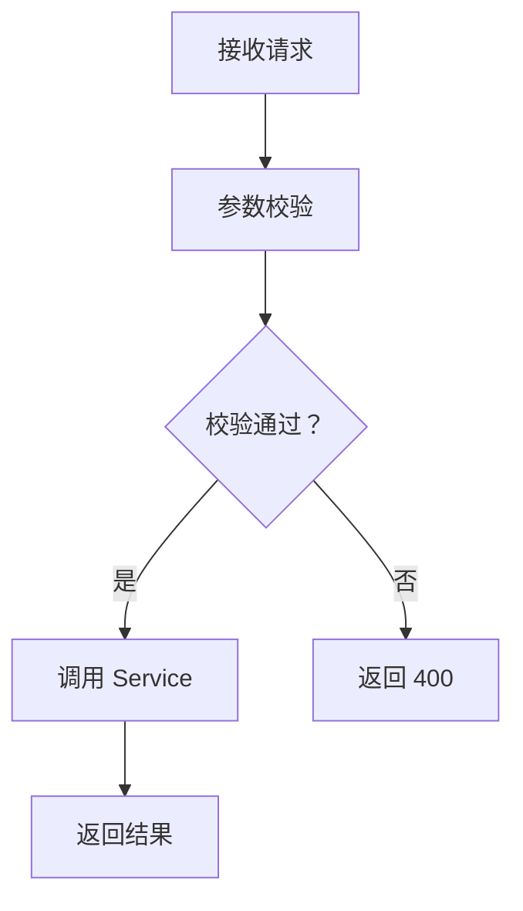

# API 文档编写规范

**版本**: v1.0  
**创建日期**: 2026-04-01  
**维护人**: [架构师]

---

## 📋 1. 文档目的

规范每个子项目 API.md 的编写格式，确保：
- 接口定义清晰、完整
- 路由/参数/响应格式统一
- 与需求文档对齐
- 便于前后端协作

---

## 📁 2. 文档位置

每个子项目根目录下创建 `API.md`：

```
{项目根目录}/
├── backend/
│   ├── {服务名}/API.md
│   └── ...
├── frontend/
│   ├── {前端项目}/API.md
│   └── ...
└── algorithm/
    ├── {算法模块}/API.md
    └── ...
```

---

## 📝 3. 文档结构

每个 API.md 必须包含以下章节：

### 3.1 项目概述（必填）

```markdown
# {子项目名} - API 接口文档

**版本**: v1.0-MVP  
**创建日期**: 2026-04-01  
**对齐文档**: PRD §X.X, requirements-spec §X.X, user-stories US-XX

## 📋 1. 项目定位

{200 字以内，说明本子项目的职责和对外封装的能力}
```

### 3.2 接口总览（必填）

```markdown
## 📊 2. 接口总览

| 接口名 | 路由 | 方法 | 对应需求 | 优先级 |
|--------|------|------|---------|--------|
| 数据上传 | /api/v1/data/upload | POST | 需求 1.1 | P0 |
| 数据查询 | /api/v1/data/query | GET | 需求 1.2 | P0 |
| ... | ... | ... | ... | ... |

**总计**: X 个接口（P0: X 个，P1: X 个，P2: X 个）
```

### 3.3 接口详情（必填）

每个接口单独一节，按以下模板编写：

```markdown
## 📌 3. 接口详情

### 3.X {接口名称}

**路由**: `{HTTP_METHOD} /api/v1/{module}/{resource}`

**对应需求**: 
- PRD v1.2 §X.X
- requirements-spec v2.2 §X.X
- user-stories v1.1 US-XX
- test-plan v2.3 TC-XXX

**接口描述**: 
{100 字以内，说明接口职责和大致逻辑}

**请求参数**:

| 参数名 | 类型 | 位置 | 必填 | 说明 | 示例 |
|--------|------|------|------|------|------|
| dataset_id | String | path | 是 | 数据集 ID | "ds_001" |
| page | Integer | query | 否 | 页码，默认 1 | 1 |
| limit | Integer | query | 否 | 每页数量，默认 20 | 20 |
| filter | Object | body | 否 | 过滤条件 | {"status": "active"} |

**请求示例**:

```json
POST /api/v1/data/upload
Content-Type: application/json

{
  "dataset_id": "ds_001",
  "file_name": "data.csv",
  "description": "测试数据"
}
```

**响应格式**:

```json
{
  "code": 200,
  "message": "success",
  "data": {
    "upload_id": "up_001",
    "status": "processing",
    "total_rows": 1000
  }
}
```

**错误码**:

| 错误码 | 说明 | 处理建议 |
|--------|------|---------|
| 400 | 参数错误 | 检查请求参数格式 |
| 404 | 资源不存在 | 检查 dataset_id |
| 500 | 服务器错误 | 联系运维 |

**业务逻辑**:


**单元测试**:
- 对应测试文件：`src/test/java/.../{Module}ControllerTest.java`
- 对应测试方法：`test_{接口名}_{场景}`
```

### 3.4 数据模型（可选）

```markdown
## 🗃️ 4. 数据模型

### 4.X {模型名称}

```json
{
  "type": "object",
  "properties": {
    "id": {"type": "string", "description": "唯一标识"},
    "name": {"type": "string", "description": "名称"},
    "created_at": {"type": "string", "format": "date-time"}
  },
  "required": ["id", "name"]
}
```
```

### 3.5 附录（可选）

```markdown
## 📎 5. 附录

### 5.1 变更记录

| 版本 | 日期 | 变更内容 | 作者 |
|------|------|---------|------|
| v1.0 | 2026-04-01 | 初始版本 | {姓名} |

### 5.2 参考文档

- PRD v1.2: `specs/prd.md`
- requirements-spec v2.2: `specs/requirements-spec.md`
- user-stories v1.1: `specs/user-stories.md`
- architecture-design v1.5: `specs/architecture-design.md`
```

---

## 🎯 4. 编写要求

### 4.1 必须对齐的文档

编写 API.md 前必须阅读：
1. ✅ `[项目]/specs/prd.md` - 理解产品需求
2. ✅ `[项目]/specs/requirements-spec.md` - 理解功能规格
3. ✅ `[项目]/specs/user-stories.md` - 理解用户场景
4. ✅ `[项目]/specs/architecture-design.md` - 理解技术架构
5. ✅ `[项目]/specs/test-plan.md` - 理解测试用例

### 4.2 接口定义原则

1. **RESTful 风格**:
   - 资源用复数名词：`/api/v1/users`
   - 动词用 HTTP Method：GET/POST/PUT/DELETE
   - 嵌套不超过 2 层：`/api/v1/users/{id}/posts`

2. **参数规范**:
   - path 参数：资源标识（id, name）
   - query 参数：过滤、分页、排序
   - body 参数：创建/更新数据

3. **响应规范**:
   - 统一格式：`{code, message, data}`
   - 成功：code=200/201
   - 失败：code=4xx/5xx

4. **错误码规范**:
   - 2xx：成功
   - 400：参数错误
   - 401：未认证
   - 403：无权限
   - 404：资源不存在
   - 500：服务器错误

### 4.3 优先级定义

| 优先级 | 说明 | 占比要求 |
|--------|------|---------|
| **P0** | MVP 核心功能，必须实现 | ≥60% |
| **P1** | 重要功能，建议实现 | ≥30% |
| **P2** | 优化功能，可选实现 | ≤10% |

---

## ✅ 5. 检查清单

编写完成后自检查：

- [ ] 接口总览表完整（路由/方法/需求/优先级）
- [ ] 每个接口有对应需求文档引用
- [ ] 每个接口有请求参数表
- [ ] 每个接口有请求示例
- [ ] 每个接口有响应格式
- [ ] 每个接口有错误码说明
- [ ] 每个接口有业务逻辑流程图
- [ ] 每个接口有对应单元测试引用
- [ ] 数据模型定义完整（如需要）
- [ ] 变更记录填写（如需要）

---

## 📊 6. 示例参考

完整示例参考：
- `[项目]/backend/{服务名}/API.md`（后端示例）
- `[项目]/frontend/{前端项目}/API.md`（前端示例）
- `[项目]/algorithm/{算法模块}/API.md`（算法示例）

---

**最后更新**: 2026-04-01  
**状态**: ✅ 规范已定义，可开始编写
