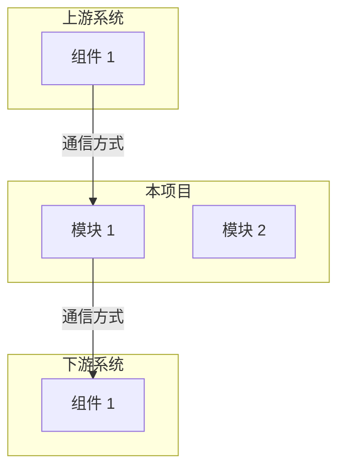
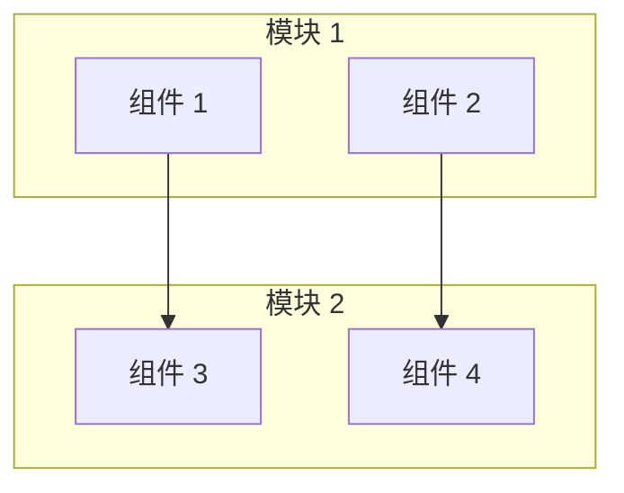
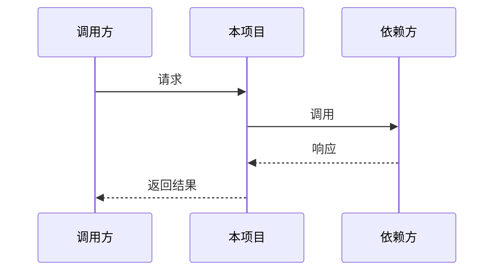
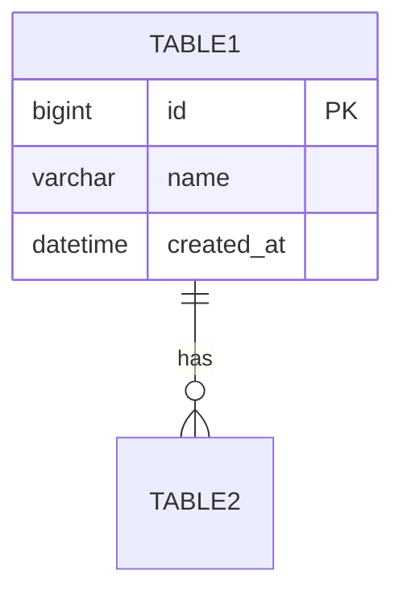
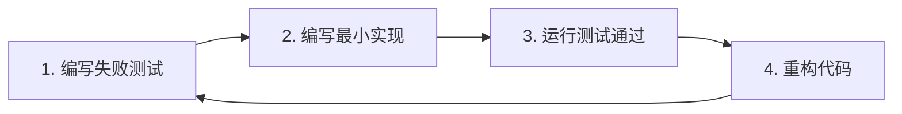
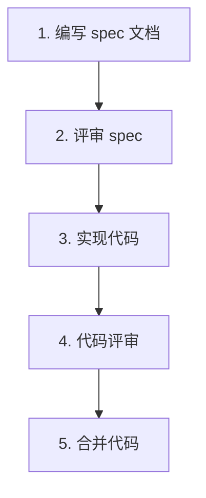

# 项目 README.md 编写规范

**版本**: v1.0  
**创建日期**: 2026-03-31  
**最后更新**: 2026-04-29  
**适用范围**: 所有软件工程项目的子项目（请根据实际项目调整）

---

## 📋 1. 文档目的

本规范定义了软件工程项目的子项目 README.md 的标准格式和内容要求，确保文档的一致性、完整性和可读性。

---

## 🏗️ 2. 标准格式框架

### 2.1 文档结构 (7 个核心部分)

```markdown
# {项目名称}

**版本**: v{版本号}-MVP  
**创建日期**: YYYY-MM-DD  
**最后更新**: YYYY-MM-DD  
**对齐文档**: [项目需求文档], [项目架构设计文档]

---

## 📋 1. 项目定位与概述

### 1.1 在整体项目中的位置

### 1.2 核心工作内容

### 1.3 相关 specs 文档索引

---

## 🏗️ 2. 技术架构

### 2.1 核心功能架构图

### 2.2 调用序列图/流程图/ER 图

### 2.3 技术选型

---

## 📦 3. 项目依赖

### 3.1 代码依赖

### 3.2 中间件依赖

---

## 📝 4. 开发规范 (TDD + SDD)

### 4.1 测试驱动开发 (TDD) 流程

### 4.2 规范驱动开发 (SDD)

---

## 🚀 5. 打包部署方法

### 5.1 本地开发环境

### 5.2 生产环境部署

---

## 📁 6. 目录结构

---

## ⚠️ 7. 数据安全与保密
```

---

## 📊 3. 各部分详细要求

### 3.1 文档头部

**必需字段**:
```markdown
# {项目名称}

**版本**: v{版本号}-MVP  
**创建日期**: YYYY-MM-DD  
**最后更新**: YYYY-MM-DD  
**对齐文档**: PRD v1.2 §X.X, architecture-design v1.4 §X.X
```

**要求**:
- 版本号格式：`v{主版本}.{次版本}-MVP` (如 `v1.0-MVP`)
- 日期格式：`YYYY-MM-DD`
- 对齐文档：必须列出对应的 PRD 章节和 architecture-design 章节

---

### 3.2 项目定位与概述

#### 3.2.1 在整体项目中的位置

**必需内容**:
- 文字描述本项目在整体架构中的位置
- 整体架构 mermaid 图 (graph TB)

**示例**:
```markdown
### 1.1 在整体项目中的位置

**{项目名称}** 是 Phase 1 MVP 的**{角色定位}**，位于整体架构的**{层级}**，通过**{通信方式}**与**{上下游}**交互。


```

#### 3.2.2 核心工作内容

**必需内容**:
- 表格列出所有核心模块
- 每个模块对应 PRD 菜单

**示例**:
```markdown
### 1.2 核心工作内容

| 模块 | 职责 | 对应 PRD 菜单 |
|------|------|------------|
| **模块 1** | 职责描述 | §X.X/菜单项 |
| **模块 2** | 职责描述 | §X.X/菜单项 |
```

#### 3.2.3 相关 specs 文档索引

**必需内容**:
- 表格列出所有相关 specs 文档
- 包含文档路径和说明

**示例**:
```markdown
### 1.3 相关 specs 文档索引

| 文档 | 路径 | 说明 |
|------|------|------|
| **PRD v1.2** | `specs/prd.md` | 产品需求 (§X.X) |
| **requirements-spec v2.2** | `specs/requirements-spec.md` | 需求规格 |
| **architecture-design v1.4** | `specs/architecture-design.md` | 技术架构 (§X.X) |
| **test-plan v2.0** | `specs/test-plan-v2.0.md` | 测试计划 |
```

---

### 3.3 技术架构

#### 3.3.1 核心功能架构图

**必需内容**:
- 至少 1 张 mermaid 架构图 (graph TB 或 graph LR)
- 使用 subgraph 分组
- 标注关键组件

**示例**:
```markdown
### 2.1 核心功能架构图


```

#### 3.3.2 调用序列图/流程图/ER 图

**根据项目类型选择**:

| 项目类型 | 必需图表 | mermaid 类型 |
|---------|---------|-------------|
| **前端项目** | 页面流程图、交互序列图 | `graph LR`、`sequenceDiagram` |
| **后端项目** | 业务架构图、ER 图、状态图 | `graph TB`、`erDiagram`、`stateDiagram-v2` |
| **算法项目** | 算法流程图、调用序列图 | `graph LR`、`sequenceDiagram` |

**示例 (序列图)**:
```markdown
### 2.2 调用序列图


```

**示例 (ER 图)**:
```markdown
### 2.2 数据模型 ER 图


```

#### 3.3.3 技术选型

**必需内容**:
- 表格列出所有核心技术
- 包含版本、用途、选型理由

**示例**:
```markdown
### 2.3 技术选型

| 技术 | 版本 | 用途 | 选型理由 |
|------|------|------|---------|
| **JDK** | 1.8 | 主语言 | 稳定版本，团队熟悉 |
| **SpringBoot** | 2.7.x | Web 框架 | 避免 3.x 破坏性变更 |
| **MyBatis** | - | ORM 框架 | 灵活 SQL 控制 |
```

**选型理由要求**:
- 简洁明了 (≤20 字)
- 说明为什么选择该技术而非其他

---

### 3.4 项目依赖

#### 3.4.1 代码依赖

**根据项目类型提供**:

**前端项目 (package.json)**:
```json
{
  "dependencies": {
    "vue": "^3.3.0",
    "axios": "^1.4.0"
  },
  "devDependencies": {
    "vite": "^4.4.0",
    "vitest": "^0.33.0"
  }
}
```

**后端项目 (Maven pom.xml)**:
```xml
<dependencies>
    <dependency>
        <groupId>org.springframework.boot</groupId>
        <artifactId>spring-boot-starter-web</artifactId>
        <version>2.7.14</version>
    </dependency>
</dependencies>
```

**算法项目 (requirements.txt)**:
```txt
fastapi>=0.100.0
uvicorn>=0.23.0
numpy>=1.24.0
```

#### 3.4.2 中间件依赖

**必需内容**:
- 表格列出所有中间件
- 包含版本和用途

**示例**:
```markdown
### 3.2 中间件依赖

| 中间件 | 版本 | 用途 |
|--------|------|------|
| **SQLite** | 3.x | MVP 阶段元数据存储 |
| **PostgreSQL** | 15.x | Phase 2 升级 |
```

---

### 3.5 开发规范 (TDD + SDD)

#### 3.5.1 测试驱动开发 (TDD) 流程

**必需内容**:
- TDD 流程图 (mermaid graph LR)
- 覆盖率要求

**示例**:
```markdown
### 4.1 测试驱动开发 (TDD) 流程



**覆盖率要求**: ≥80%

**测试命令**:
```bash
# 前端
npm run test

# 后端
mvn test -pl backend/{项目名}

# 算法
pytest --cov=algorithm --cov-report=html
```
```

#### 3.5.2 规范驱动开发 (SDD)

**必需内容**:
- SDD 流程图 (mermaid graph TB)
- spec 文档位置说明

**示例**:
```markdown
### 4.2 规范驱动开发 (SDD)



**spec 文档位置**: `specs/` 目录下对应模块的 spec 文档
```

---

### 3.6 打包部署方法

#### 3.6.1 本地开发环境

**必需内容**:
- 完整的本地开发命令
- 分步骤说明

**示例**:
```markdown
### 5.1 本地开发环境

```bash
# 1. 安装依赖
npm install  # 前端
mvn clean install  # 后端
pip install -r requirements.txt  # 算法

# 2. 启动开发服务器
npm run dev  # 前端
mvn spring-boot:run  # 后端
uvicorn main:app --reload  # 算法

# 3. 访问地址
# http://localhost:5173  # 前端
# http://localhost:8080  # 后端
# http://localhost:8000  # 算法
```
```

#### 3.6.2 生产环境部署

**必需内容**:
- 构建命令
- 部署命令
- 健康检查命令

**示例**:
```markdown
### 5.2 生产环境部署

```bash
# 1. 构建
npm run build  # 前端
mvn clean package -DskipTests  # 后端
docker build -t image:tag .  # 算法

# 2. 部署
cp -r dist/ /usr/share/nginx/html/  # 前端
java -jar target/app-1.0.jar  # 后端
docker run -d -p 8000:8000 image:tag  # 算法

# 3. 健康检查
curl http://localhost/health
```
```

---

### 3.7 目录结构

**必需内容**:
- 完整的目录树
- 关键文件注释

**示例**:
```markdown
## 📁 6. 目录结构

```
{项目名}/
├── README.md                     # 本文件
├── package.json                  # 项目配置
├── src/
│   ├── main.js                   # 入口文件
│   ├── views/                    # 页面组件
│   ├── components/               # 通用组件
│   ├── api/                      # API 封装
│   ├── stores/                   # 状态管理
│   └── router/                   # 路由配置
└── tests/                        # 测试文件
```
```

**要求**:
- 使用代码块 (```)
- 关键文件添加注释 (# 注释)
- 深度≤3 层

---

### 3.8 数据安全与保密

**必需内容**:
- 固定的数据安全声明

**示例**:
```markdown
## ⚠️ 7. 数据安全与保密

- ❌ **所有代码不允许落在云存储**
- ❌ **禁止**: 飞书云盘、知识库、在线文档等
- ✅ **只能**: 本地存储 (`~/.openclaw/workspace/`)
```

---

## 🎨 4. 格式规范

### 4.1 标题层级

```markdown
# 项目名称 (H1)

## 📋 1. 项目定位与概述 (H2)

### 1.1 在整体项目中的位置 (H3)

#### 1.1.1 详细说明 (H4，尽量少用)
```

**要求**:
- H1: 仅项目名称使用
- H2: 7 个核心部分
- H3: 各部分的小节
- H4: 尽量避免

### 4.2 表情符号使用

| 章节 | 表情符号 |
|------|---------|
| 1. 项目定位与概述 | 📋 |
| 2. 技术架构 | 🏗️ |
| 3. 项目依赖 | 📦 |
| 4. 开发规范 | 📝 |
| 5. 打包部署方法 | 🚀 |
| 6. 目录结构 | 📁 |
| 7. 数据安全与保密 | ⚠️ |

### 4.3 代码块规范

**带语言标识**:
```markdown
```bash
# 命令
```

```json
{
  "key": "value"
}
```

```python
def func():
    pass
```
```

### 4.4 mermaid 图规范

**必需使用 mermaid 的场景**:
1. 整体架构图 (graph TB)
2. 业务流程图 (graph LR 或 graph TB)
3. 调用序列图 (sequenceDiagram)
4. 数据模型图 (erDiagram)
5. 状态转换图 (stateDiagram-v2)
6. TDD/SDD 流程图 (graph LR 或 graph TB)

**禁止事项**:
- 使用 ASCII Art 替代 mermaid (除非极复杂架构)
- mermaid 代码不换行

---

## ✅ 5. 检查清单

在提交 README.md 前，必须检查以下项目：

### 5.1 内容完整性

- [ ] 7 个核心部分全部包含
- [ ] 版本信息完整 (版本号、创建日期、最后更新、对齐文档)
- [ ] 至少 1 张 mermaid 架构图
- [ ] 至少 1 张 mermaid 流程图/序列图/ER 图
- [ ] 技术选型表格完整
- [ ] 依赖列表完整 (代码依赖 + 中间件依赖)
- [ ] TDD 流程图包含
- [ ] SDD 流程图包含
- [ ] 本地开发命令完整
- [ ] 生产部署命令完整
- [ ] 目录结构完整

### 5.2 格式规范性

- [ ] 标题层级正确 (H1→H2→H3)
- [ ] 表情符号使用正确
- [ ] 代码块带语言标识
- [ ] mermaid 图语法正确
- [ ] 表格格式正确
- [ ] 链接使用相对路径

### 5.3 内容准确性

- [ ] PRD 章节引用准确
- [ ] architecture-design 章节引用准确
- [ ] 技术选型理由合理
- [ ] 依赖版本号准确
- [ ] 命令可执行

---

## 📞 6. 维护与更新

### 6.1 更新触发条件

以下情况需要更新 README.md：
1. 技术栈变更
2. 依赖版本升级
3. 目录结构变化
4. 部署流程变更
5. 对应 specs 文档更新

### 6.2 更新流程

1. 更新 README.md 内容
2. 更新**最后更新**日期
3. 更新**版本号**(次版本 +1)
4. 提交代码评审

### 6.3 版本命名规则

```
v{主版本}.{次版本}-MVP
```

- **主版本**: 重大架构变更时 +1
- **次版本**: 内容更新时 +1
- **-MVP**: Phase 1 MVP 阶段固定后缀

---

## 📚 7. 参考文档

| 文档 | 路径 | 说明 |
|------|------|------|
| **PRD v1.2** | `specs/prd.md` | 产品需求 |
| **architecture-design v1.4** | `specs/architecture-design.md` | 技术架构 |
| **优秀 README 示例** | `algo/README.md` | 最完整示例 |
| **优秀 README 示例** | `backend/algorithm-platform/README.md` | 后端示例 |
| **优秀 README 示例** | `frontend/README.md` | 前端示例 |

---

**创建者**: [架构师]  
**审核者**: [项目负责人]  
**时间**: 2026-03-31 23:45
